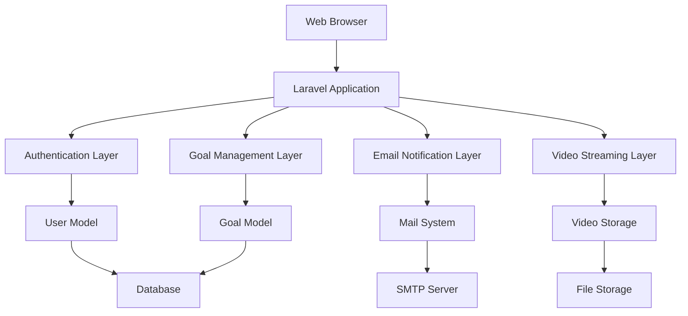

# Design Document

## Overview

The Goal Management System will be built on Laravel 12 with a traditional MVC architecture. The system leverages Laravel's built-in authentication, email verification, and notification systems. The application follows RESTful principles with server-side rendered views using Blade templates and includes a video streaming component for educational content.

## Architecture

### High-Level Architecture



### Request Flow

1. **Authentication Flow**: Registration → Email Verification → Login → Dashboard
2. **Onboarding Flow**: First Login → Video Viewing → Goal Creation
3. **Goal Management Flow**: Create Goal → View Goals → Mark Complete → Email Notification

## Components and Interfaces

### Models

#### User Model (Enhanced)
```php
class User extends Authenticatable implements MustVerifyEmail
{
    protected $fillable = ['name', 'email', 'password', 'onboarding_completed'];
    protected $casts = [
        'email_verified_at' => 'datetime',
        'onboarding_completed' => 'boolean',
        'password' => 'hashed',
    ];
    
    public function goals(): HasMany;
    public function hasCompletedOnboarding(): bool;
    public function markOnboardingComplete(): void;
}
```

#### Goal Model
```php
class Goal extends Model
{
    protected $fillable = ['title', 'description', 'end_date', 'status', 'completed_at'];
    protected $casts = [
        'end_date' => 'date',
        'completed_at' => 'datetime',
    ];
    
    public function user(): BelongsTo;
    public function markComplete(): void;
    public function isOverdue(): bool;
    public function getDaysRemaining(): int;
}
```

### Controllers

#### AuthController
- Handles registration with email verification
- Manages login/logout functionality
- Redirects to appropriate post-login destination

#### OnboardingController
- Serves video content for new users
- Tracks video completion status
- Manages onboarding flow completion

#### GoalController
- CRUD operations for goals
- Goal completion handling
- Dashboard view with goal statistics

#### NotificationController
- Handles email notifications for goal completion
- Manages notification preferences

### Services

#### GoalCompletionService
```php
class GoalCompletionService
{
    public function completeGoal(Goal $goal): void;
    private function sendCompletionNotification(Goal $goal): void;
    private function updateGoalStatus(Goal $goal): void;
}
```

#### VideoService
```php
class VideoService
{
    public function getOnboardingVideo(): string;
    public function trackVideoCompletion(User $user): void;
}
```

## Data Models

### Database Schema

#### Users Table (Enhanced)
```sql
CREATE TABLE users (
    id BIGINT UNSIGNED AUTO_INCREMENT PRIMARY KEY,
    name VARCHAR(255) NOT NULL,
    email VARCHAR(255) UNIQUE NOT NULL,
    email_verified_at TIMESTAMP NULL,
    password VARCHAR(255) NOT NULL,
    onboarding_completed BOOLEAN DEFAULT FALSE,
    remember_token VARCHAR(100) NULL,
    created_at TIMESTAMP NULL,
    updated_at TIMESTAMP NULL
);
```

#### Goals Table
```sql
CREATE TABLE goals (
    id BIGINT UNSIGNED AUTO_INCREMENT PRIMARY KEY,
    user_id BIGINT UNSIGNED NOT NULL,
    title VARCHAR(255) NOT NULL,
    description TEXT NULL,
    end_date DATE NOT NULL,
    status ENUM('active', 'completed', 'cancelled') DEFAULT 'active',
    completed_at TIMESTAMP NULL,
    created_at TIMESTAMP NULL,
    updated_at TIMESTAMP NULL,
    FOREIGN KEY (user_id) REFERENCES users(id) ON DELETE CASCADE
);
```

#### Goal Notifications Table
```sql
CREATE TABLE goal_notifications (
    id BIGINT UNSIGNED AUTO_INCREMENT PRIMARY KEY,
    goal_id BIGINT UNSIGNED NOT NULL,
    recipient_email VARCHAR(255) NOT NULL,
    sent_at TIMESTAMP NULL,
    status ENUM('pending', 'sent', 'failed') DEFAULT 'pending',
    created_at TIMESTAMP NULL,
    updated_at TIMESTAMP NULL,
    FOREIGN KEY (goal_id) REFERENCES goals(id) ON DELETE CASCADE
);
```

### Relationships

- User hasMany Goals
- Goal belongsTo User
- Goal hasMany GoalNotifications

## Error Handling

### Validation Rules

#### Goal Creation
- Title: required, max 255 characters
- Description: optional, max 1000 characters
- End Date: required, must be future date

#### User Registration
- Name: required, max 255 characters
- Email: required, valid email, unique
- Password: required, min 8 characters, confirmed

### Exception Handling

#### Custom Exceptions
```php
class GoalCompletionException extends Exception {}
class EmailNotificationException extends Exception {}
class VideoStreamingException extends Exception {}
```

#### Error Responses
- Validation errors: 422 with field-specific messages
- Authentication errors: 401 with redirect to login
- Authorization errors: 403 with user-friendly message
- Server errors: 500 with logged details

### Logging Strategy
- Goal completions logged at INFO level
- Email notification failures logged at ERROR level
- Authentication attempts logged at DEBUG level
- Video streaming issues logged at WARNING level

## Testing Strategy

### Unit Tests
- Model methods and relationships
- Service class business logic
- Validation rules and custom exceptions
- Email notification formatting

### Feature Tests
- Complete user registration and verification flow
- Goal creation, viewing, and completion workflow
- Email notification sending and tracking
- Video viewing and onboarding completion
- Authentication and authorization scenarios

### Integration Tests
- End-to-end user journey from registration to goal completion
- Email delivery integration with mail services
- Video streaming functionality
- Database transaction integrity

### Test Data Management
- Factory classes for User and Goal models
- Seeder classes for development environment
- Mock email services for testing
- Test video files for streaming tests

## Security Considerations

### Authentication & Authorization
- Laravel Sanctum for session management
- Email verification required before access
- CSRF protection on all forms
- Rate limiting on authentication endpoints

### Data Protection
- Password hashing using Laravel's Hash facade
- Input sanitization and validation
- SQL injection prevention through Eloquent ORM
- XSS protection via Blade template escaping

### Email Security
- Encrypted SMTP connections
- Email rate limiting to prevent spam
- Validation of email addresses before sending
- Logging of email delivery attempts

## Performance Considerations

### Database Optimization
- Indexes on frequently queried columns (user_id, status, end_date)
- Eager loading for goal-user relationships
- Database query optimization for dashboard views
- Soft deletes for data retention

### Caching Strategy
- Cache user onboarding status
- Cache goal statistics for dashboard
- Video metadata caching
- Session-based caching for user preferences

### Video Delivery
- Efficient video encoding and compression
- Progressive video loading
- CDN integration for video assets
- Bandwidth optimization for different connection speeds